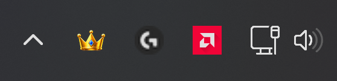
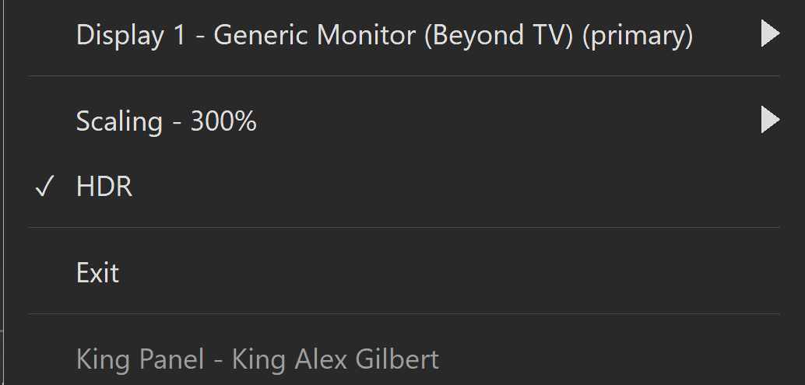
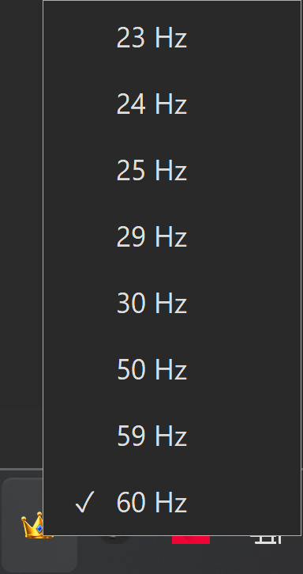

<p align="center">
  
</p>

<h1 align="center">King Panel</h1>

King Panel is an extremely lightweight refresh-rate and resolution modifier for Windows. 
When running at idle, King Panel uses virtually no CPU or GPU resources and only consumes about 1.2MB of RAM.

King Panel supports:
- Refresh rate
- Resolution
- Display Scaling
- Multi-Monitor Support
- HDR Toggle
  
It lives in your system tray, making it extremely easy to use, **the crown controls all**. 
Left click: it brings up a simple menu to change refresh rate.
Right click: it brings up an in-depth menu where you can change your refresh rate, resolution, display scaling, HDR, and settings for multiple monitors.

This was made to avoid the amount of menus Windows 11 makes you go through just to change your monitor settings, especially refresh-rate. 

King Panel was made with AI-assisted coding.

Made by: **King Alex Gilbert**

## Screenshots

### King Panel in System Tray



### Menu: Right Click



### Menu: Left Click



## Install

### Recommended
1. Download `KingPanel-Setup-1.0.0.exe` from the [latest GitHub release](https://github.com/KingAlexGilbert/king-post/releases/latest).
2. Double-click the exe.
3. Run through the setup options; setup installs to `Program Files\King Panel`.
4. The installer offers optional startup, desktop, and Start menu shortcuts for all users.
5. Run King Panel from your chosen shortcut or file location.
6. King Panel should now show up in the system tray.

### Portable

A portable `KingPanel.exe` is also available. Exit an existing copy before updating.

1. Double-click the exe.
2. King Panel should now show up in the system tray.

## Installation Note

Resolution and refresh-rate changes revert after 15 seconds unless you choose "Keep".

The Windows installer is currently unsigned, so Windows may show an unknown publisher or SmartScreen warning. This is normal for unsigned indie releases.

If you trust this official GitHub release, choose **More info → Run anyway** if SmartScreen appears.

## Build

Install Zig 0.13.0 outside this folder. To build the installer, also install NSIS 3.

```bat
build.cmd app
build.cmd installer
```

The script finds installed tools or accepts full paths through `ZIG_EXE` and
`NSIS_EXE`. It does not download tools. Output files appear in the project root.

## Privacy

King Panel is local-first. Your display information and settings are processed locally and are not sent to external servers.

## License

This project is released under the GNU General Public License v3.0.

Distributed modified versions must follow the terms of the GPLv3. See the `LICENSE` file for the complete license terms.

Copyright (C) 2026 King Alex Gilbert

## References

I want to give credit to the GitHub projects that helped inspire King Panel:

- [RefreshRateSwitcher](https://github.com/Yeeyash/refresh-rate-switcher) by [@Yeeyash](https://github.com/Yeeyash)
- [windisplay](https://github.com/zpix1/windisplay) by [@zpix1](https://github.com/zpix1)

Special thanks to their developers for sharing their work and helping inspire King Panel.
